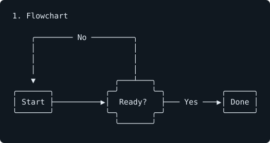
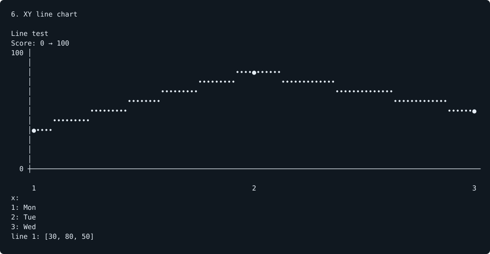
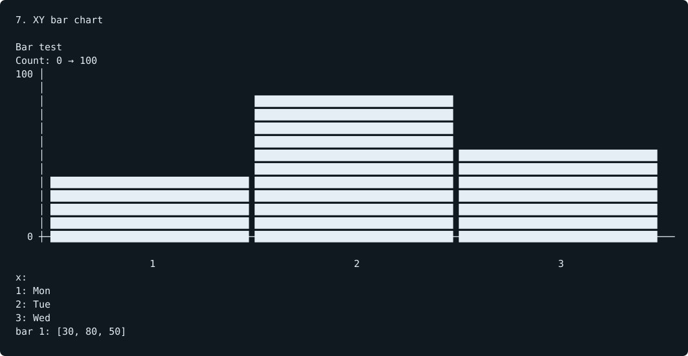
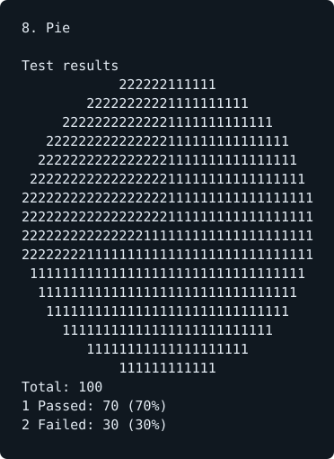
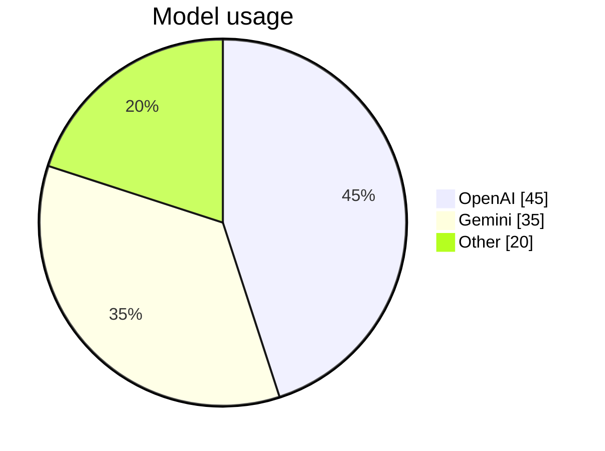
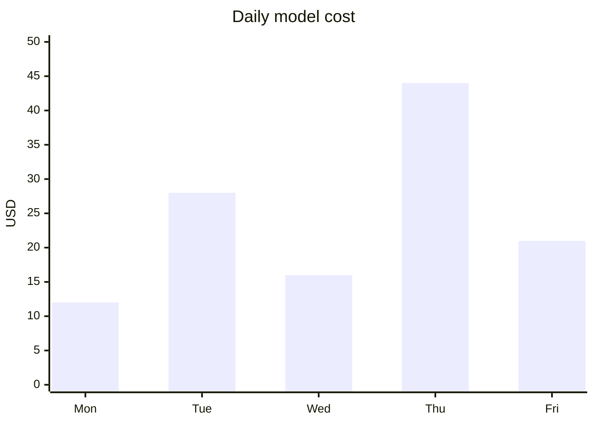

# OpenCode Merman

Native terminal Mermaid diagrams for OpenCode V2. Derived from OpenCode's official Merman renderer, with the diagram families missing from our 22-sample rendering test added.

**OpenCode V2 only. Requires stable OpenCode 2.0.22+ in the 2.x series. OpenCode V1 is not supported.**

This is an independent project, not an official OpenCode release. See [upstream provenance](UPSTREAM.md) and the retained [MIT license](LICENSE).

## What the terminal output looks like

These are monochrome previews generated from the actual installed OpenCode 2.0.22 terminal capture, not GitHub's browser Mermaid rendering. The plugin uses your terminal theme and colored chart series; these previews preserve the captured character layout without reproducing terminal colors. [Plain-text output](examples/output/) is included too.

### Flowchart



### Line and bar charts





### Pie chart



## One-command install

**npm publication is pending for this release. Use the GitHub CLI alternative below now.** The npm command becomes available after `opencode-merman` is published to the registry.

Requires Node.js 20+, npm, and `opencode` on your PATH.

```sh
npx --yes opencode-merman@latest install
```

Restart the OpenCode terminal client, then ask for a Mermaid diagram. No API keys or server configuration changes are needed. This is a CLI-only plugin and also works when your terminal client connects to a remote OpenCode server.

The installer checks the OpenCode version before editing anything, preserves existing settings and comments, backs up an existing configuration, and adds the pinned package version to global `cli.json`. It respects `XDG_CONFIG_HOME`, disables the bundled Mermaid renderer, and can be rerun to update without duplicating entries. It does not restart services. A successful installation means configuration was updated, not that rendering was verified on your machine.

### GitHub CLI alternative

Use a persistent checkout if you prefer GitHub to npm package loading. Requires `gh`, Node.js 20+, and npm. Run once; the destination must not already exist.

```sh
mkdir -p "$HOME/.local/share" && gh repo clone 4nkitd/opencode-merman "$HOME/.local/share/opencode-merman" -- --branch v0.1.1 && cd "$HOME/.local/share/opencode-merman" && npm install --omit=dev --ignore-scripts && node bin/cli.mjs install --local
```

Keep that checkout: OpenCode loads the plugin from its directory. The runtime dependencies include the required OpenTUI core peer; OpenCode supplies its plugin API at runtime. This route does not require the package to be published on npm.

### Uninstall

Remove `opencode-merman@...` or the checkout path and `-opencode.merman` from the `plugins` array in global `cli.json`, then restart the terminal client. The bundled renderer will handle Mermaid again. Leave other settings unchanged; only restore a backup if you also want to undo settings changed after installation.

## Try a sample

Ask OpenCode to respond with this Mermaid fence at the top level. Do not wrap it inside another code fence.





See [all 22 sample diagrams](examples/verification.md) for flowcharts, sequences, classes, ER, Sankey, architecture, and the other supported families.

## Diagrams

The original flowchart, sequence, state, Gantt, git graph, and timeline renderers are retained.

Added:

| Family | Terminal representation |
| --- | --- |
| XY | Colored line and grouped bar plots, multiple series, numeric/categorical axes, exact data values |
| Pie | Proportional slices with numbered/color legends, values, percentages |
| Quadrant | Plotted coordinates, quadrant labels, point legend |
| Sankey | Directed flow graph, labeled connections, scaled flow bars |
| Class | Member cards, annotations, relationship symbols and multiplicities |
| Entity relationship | Attribute cards, keys, relationship labels and cardinalities |
| Requirement | Requirement/element cards and typed relationships |
| Mindmap | Indented trees |
| Journey | Ordered tasks, score indicators, sections and actors |
| Kanban | Responsive columns, tasks and metadata |
| Block | Column layout, spans, spaces, labeled edges and connection ledger |
| Packet | Bit ranges, proportional fields, gaps and wrapped rows |
| Architecture | Services, junctions, ports and connections; icon names shown as text |

YAML frontmatter is accepted, including top-level titles, `config.theme`, supported text/border/line/background theme variables, and `config.themeVariables.xyChart.plotColorPalette`. Browser themes are approximated with terminal colors. Other browser-specific configuration does not change the terminal layout.

## Develop locally

Requires Bun and OpenCode V2. Development targets OpenCode 2.0.22 and OpenTUI 0.5.14.

```sh
git clone https://github.com/4nkitd/opencode-merman.git
cd opencode-merman
bun install
node bin/cli.mjs install --local
```

The local installer configures the checkout directory. To configure it manually instead, keep your existing global CLI settings and add these entries to `plugins`, replacing the path with your checkout's absolute path:

```json
{
  "plugins": [
    "-opencode.merman",
    "/absolute/path/opencode-merman"
  ]
}
```

The built-in renderer must be disabled because OpenCode permits one renderer per fence language. Use the package directory: V2.0.22 loads local CLI plugins through a physical `tui.ts` entrypoint. Restart the terminal client after changing the plugin configuration.

To remove this plugin, remove both entries and restart. OpenCode's bundled renderer will handle Mermaid again.

## Examples and checks

[The verification document](examples/verification.md) contains all 22 original samples, including YAML-configured flowcharts and XY charts.

```sh
bun run check
bun run audit:layouts
```

The tests exercise parsing, data preservation, invalid input, Unicode, resource bounds, streaming fallback, and real OpenTUI Markdown rendering at 60 and 120 columns. The inherited layout audit covers 302 sources across 306 viewport runs.

For the installed OpenCode client:

```sh
bun run script/verify-opencode.ts
node script/previews.mjs
```

This creates fixture sessions on the local OpenCode service, opens temporary terminal clients using inline configuration, and captures their screens in `artifacts/`. It compares the bundled renderer with this plugin using deterministic assistant messages, without calling an AI model. Temporary terminal processes are closed; fixture sessions remain available for inspection. It does not modify global configuration.

## Syntax boundaries

This is a terminal renderer for supported Mermaid syntax, not the full browser Mermaid engine. Unsupported or malformed syntax falls back to the original code block. During streaming, upstream Merman can retain the last successfully rendered diagram.

- XY currently supports vertical charts. Horizontal XY is rejected.
- Sankey supports positive directed acyclic flows. Cycles and self-loops are rejected.
- Class/ER/requirement bodies use multiline declarations. Namespaces, notes, interactive links and styling directives are not implemented.
- Nested block diagrams, architecture groups and advanced block shapes are not implemented.
- Mindmap annotations and inline `%%{...}%%` configuration directives are not implemented by the new renderers. Use YAML frontmatter for the supported configuration options.
- Labels and data are wrapped or listed when a terminal is too narrow for their graphical layout. Relationship ledgers retain exact connections when routes overlap.
- Colors accept hex notation or the basic color names supported by OpenTUI. Arbitrary CSS, icons and browser interactions are not loaded.

Diagram sources and canvas allocations are bounded. The parsers reject unsupported meaningful statements instead of silently dropping their data.
