# Mermaid verification

## 1. Flowchart

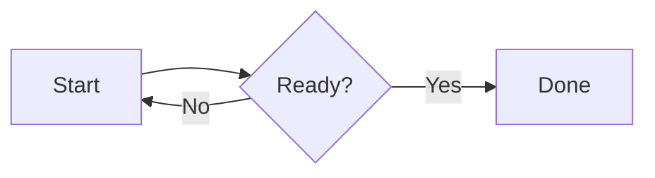

## 2. Sequence

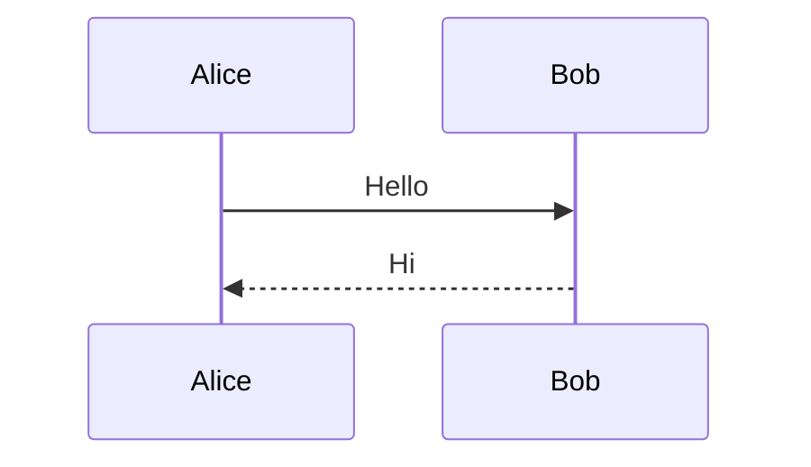

## 3. State

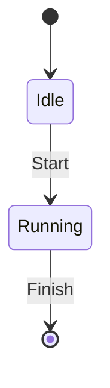

## 4. Class

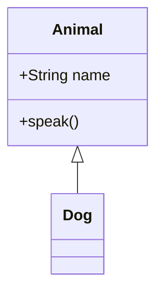

## 5. Entity relationship

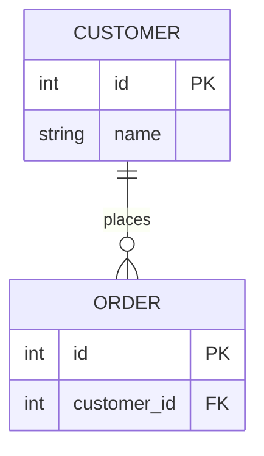

## 6. XY line chart

```mermaid
xychart-beta
    title "Line test"
    x-axis [Mon, Tue, Wed]
    y-axis "Score" 0 --> 100
    line [30, 80, 50]
```

## 7. XY bar chart

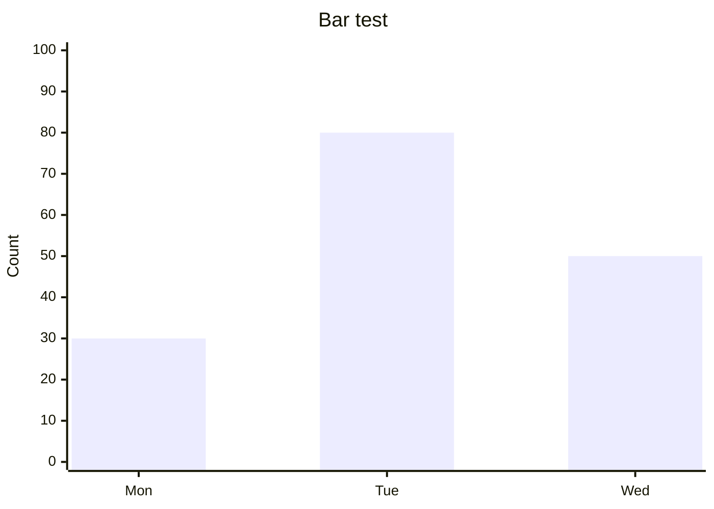

## 8. Pie

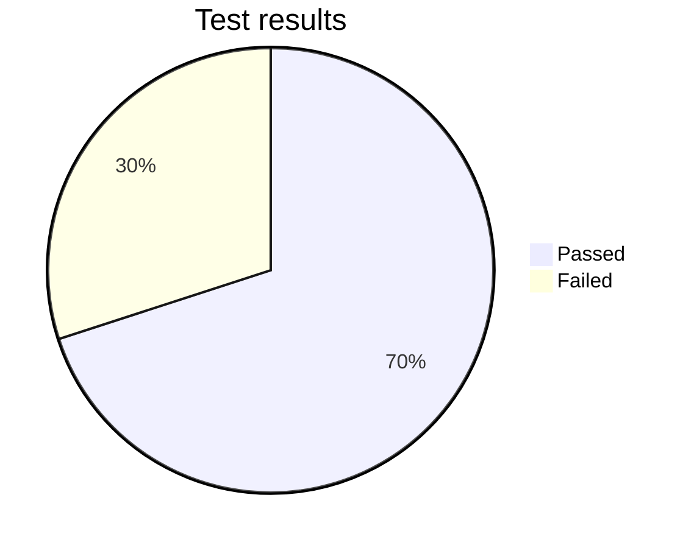

## 9. Gantt

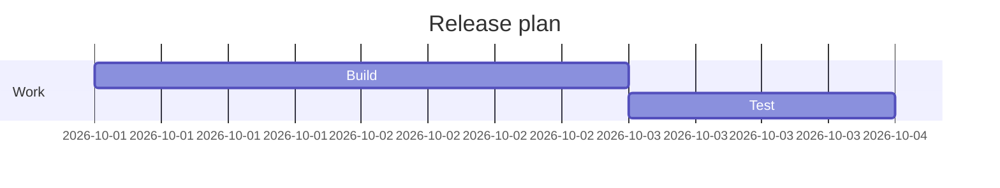

## 10. User journey

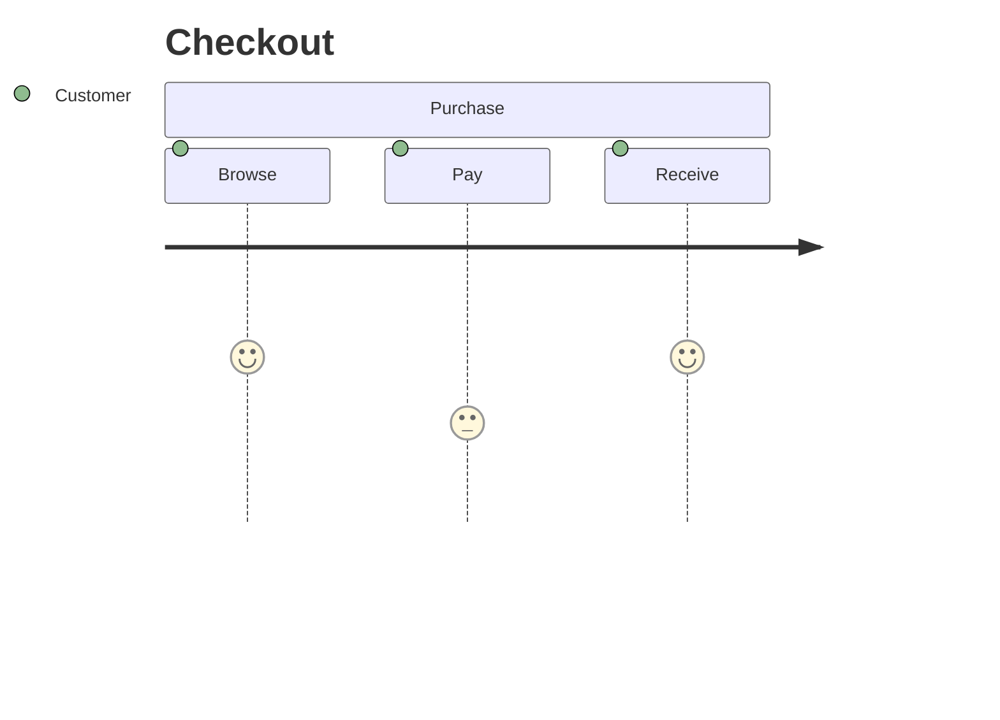

## 11. Git graph

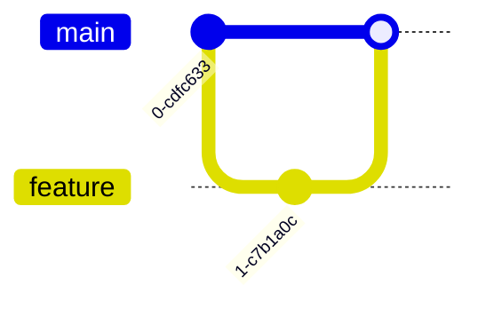

## 12. Mind map

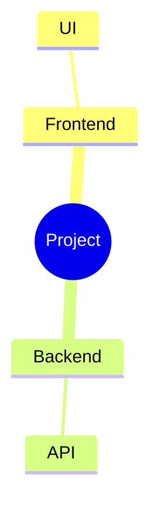

## 13. Timeline

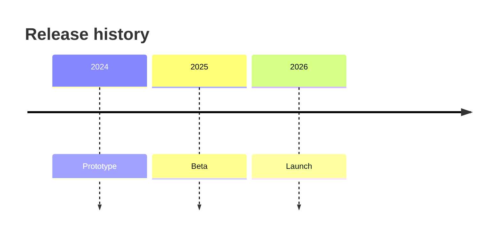

## 14. Quadrant chart

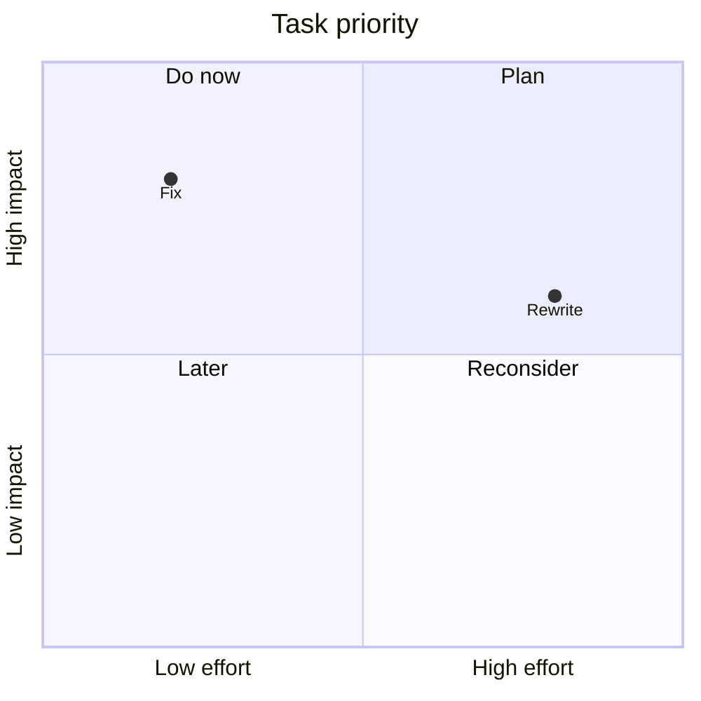

## 15. Requirement diagram

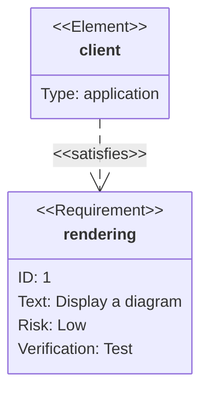

## 16. Sankey

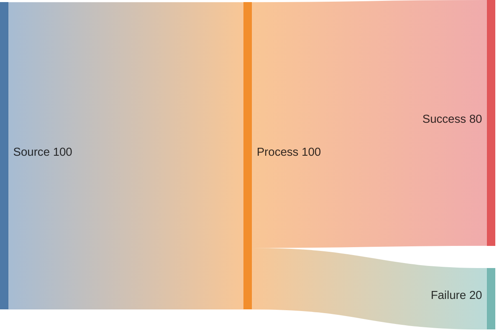

## 17. Block diagram

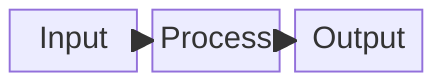

## 18. Packet diagram

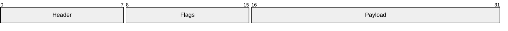

## 19. Architecture

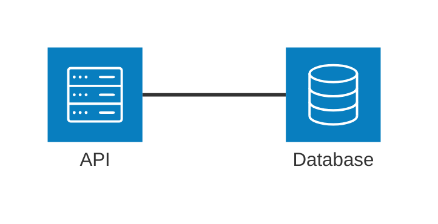

## 20. Kanban

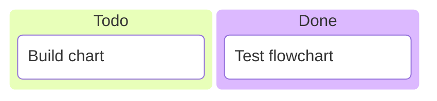

## 21. Flowchart with YAML configuration

```mermaid
---
config:
  theme: dark
---
flowchart LR
    A[Start] --> B{Ready?}
    B -->|Yes| C[Done]
    B -->|No| A
```

## 22. XY chart with YAML configuration

```mermaid
---
config:
  themeVariables:
    xyChart:
      plotColorPalette: "#3b82f6, #f97316"
---
xychart-beta
    title "Configured line test"
    x-axis [Mon, Tue, Wed]
    y-axis "Score" 0 --> 100
    line [30, 80, 50]
    line [60, 40, 70]
```
